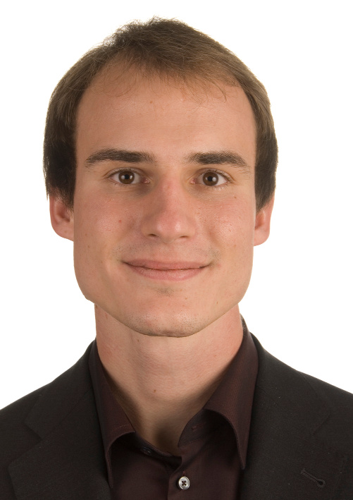

Jonas Wagner
============

--------- ----------------------
  Address Jonas Wagner\
          EPFL IC IIF DSLAB\
          INN 321, Station 14\
          1015 Lausanne\
          Switzerland

--------- ----------------------

-------- -----------------------------------------------------------------------
   Links [people.epfl.ch/jonas.wagner](http://people.epfl.ch/jonas.wagner)\
         [github.com/Sjlver](https://github.com/Sjlver)\
         [codeforces.com/profile/Sjlver](http://codeforces.com/profile/Sjlver)
 
   Email <jonas.wagner@epfl.ch>
 
  Mobile +41 76 511 22 62
-------- -----------------------------------------------------------------------

Research Interests
------------------

My mission is to create automated program analysis techniques that help
developers construct better software with ease. I prototype these techniques
into tools and evaluate them on real-world software systems.

My work lies at the intersection of verification, programming languages, and
operating systems. It is currently focused on ASAP, a technique to enforce
security properties (e.g., the absence of buffer overflows) at runtime with
high performance.

Education
---------

### PhD in Computer Science, EPFL: 2011 – present 

[dslab.epfl.ch](http://dslab.epfl.ch/)
Dependable Systems Lab, EPFL, Lausanne\
Under the direction of Prof. George Candea

### Master in Communication Systems, EPFL: 2008 - 2011

[ssc.epfl.ch/master](http://ssc.epfl.ch/master)
School of Computer and Communication Systems, EPFL, Lausanne\
Specialization in Internet Computing. Master thesis in industry, on automatic
detection of bad performance in VPN tunnels.

### Bachelor in Communication Systems, EPFL: 2005 - 2008

[ssc.epfl.ch/bachelor](http://ssc.epfl.ch/bachelor)
Two years at EPFL, Lausanne, and one year at NTU, Singapore

Projects
--------

### ASAP

[dslab.epfl.ch/proj/asap](http://dslab.epfl.ch/proj/asap)
ASAP is an automated approach and tool to instrument programs subject to
performance constraints. It combines profiling and compiler techniques to
generate programs that are as safe as possible, while satisfying the user's
overhead budget.

### -Overify

[dslab.epfl.ch/pubs/overify.pdf](http://dslab.epfl.ch/pubs/overify.pdf)
-Overify is a compiler flag that
speeds up software verification by up to 95×. It is based on the insight that
compiling for verification requires different optimizations than compiling for
fast execution, and introduces a new cost model to generate code that is
adapted to the need of verification tools.

Publications
------------

### ASAP: High Security at Low Overhead

[dslab.epfl.ch/proj/asap](http://dslab.epfl.ch/proj/asap)
Jonas Wagner, Volodymyr Kuznetsov, Johannes Kinder, Azqa Nadeem, and George Candea\
Poster presented at the 11^th^ USENIX Symposium on Operating Systems Design and Implementation (OSDI Poster), 2014

### -Overify: Optimizing Programs for Fast Verification

[dslab.epfl.ch/pubs/overify.pdf](http://dslab.epfl.ch/pubs/overify.pdf)
Jonas Wagner, Volodymyr Kuznetsov, and George Candea\
14^th^ Workshop on Hot Topics in Operating Systems (HotOS), 2013

Work experience
---------------

### Master Thesis at Open Systems: Sept. 2010 to March 2011

[www.open.ch](http://www.open.ch/)
Performance measurement of VPN links and automatic detection of performance
degradation. This project combined practical application of Perl, C and Unix
with engineering and a solid mathematical foundation. The thesis was awarded
the maximum grade and was important for upcoming network monitoring efforts at
Open Systems.

### Internship at MadeinLocal: Feb. to Aug. 2009

[www.madeinlocal.com](http://www.madeinlocal.com/)
Web development for MadeinLocal.com, the next generation local guide powered by
social networking. In a dynamic start-up team, I assumed responsibility for
developing business logic in Ruby on Rails and JavaScript, and connections to
external sites such as Facebook.

### Internship at Bucher+Suter: June to Sept. 2008

[www.bucher-suter.com](http://www.bucher-suter.com/)
I worked as a software developer on various projects using Java, C++ and PHP in
a Cisco Contact Center environment.

Teaching and Professional Service
---------------------------------

### Teaching Assistant

- **Software Engineering:** 2014, 2013, 2012
- **Calculus:** 2014
- **Introduction to Programming:** 2012, 2008, 2006
- **Information Theory and Coding:** 2010
- **Stochastic Models:** 2009

### Project Supervisor

- **Summer@EPFL Internship** by Azqa Nadeem, 2014
- **Moodle Accessibility Checker Plugin.** 
  1^st^ year master semester project by Quentin Cosendey, 2014
- **LibABC: A C Library for Software Analysis.**
  3^rd^ year bachelor semester project by Florian Vessaz, 2013

### External Reviewer

- **OSDI:** USENIX Symposium on Operating Systems Design and Implementation, 2014
- **EuroSys:**  European Conference on Computer Systems, 2014 and 2012
- **CIDR:** Conference on Innovative Data Systems Research, 2013
- **SOCC:** ACM Symposium on Cloud Computing, 2012

Miscellaneous
-------------

### Languages

- **German:** native
- **English:** Cambridge Certificate of Advanced English (level C1)
- **French:** fluent (level B2)
- **Spanish:** basic (level A2)

### PolyProg: Organizing Programming Competitions

[polyprog.epfl.ch](http://polyprog.epfl.ch/)
I am a founding member of PolyProg, a student association at EPFL that promotes
algorithmic and programming skills. I've contributed to the organization of
numerous programming contests as well as related seminars and trainings.

### Cevi: Scouting Activities for Kids

[ceviregionbern.ch](http://ceviregionbern.ch/)
As leader of a scouting group, I organize activities for children in the nature
together with a team of fellow young volunteers. Events range from an afternoon
in the forest to one-week scouting camps.

### Personal Situation

- **Birth date:**     October 20, 1985
- **Civil status:**   Unmarried
- **Nationality:**    Swiss citizen
